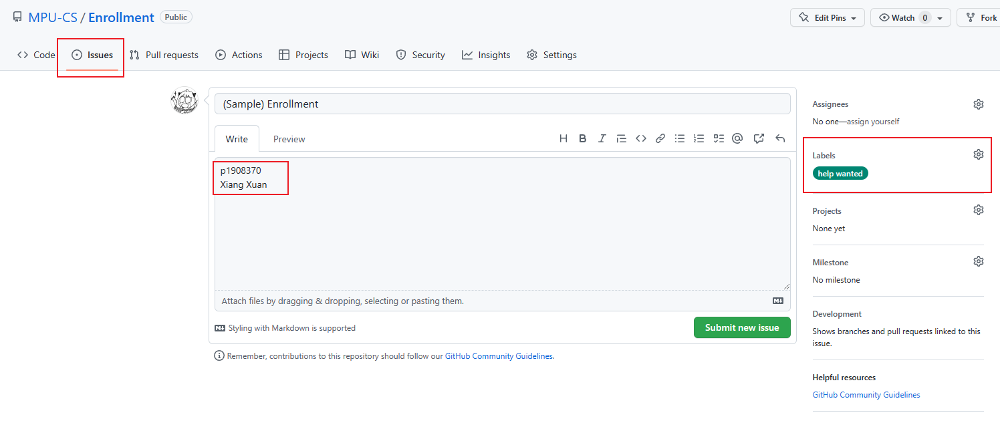
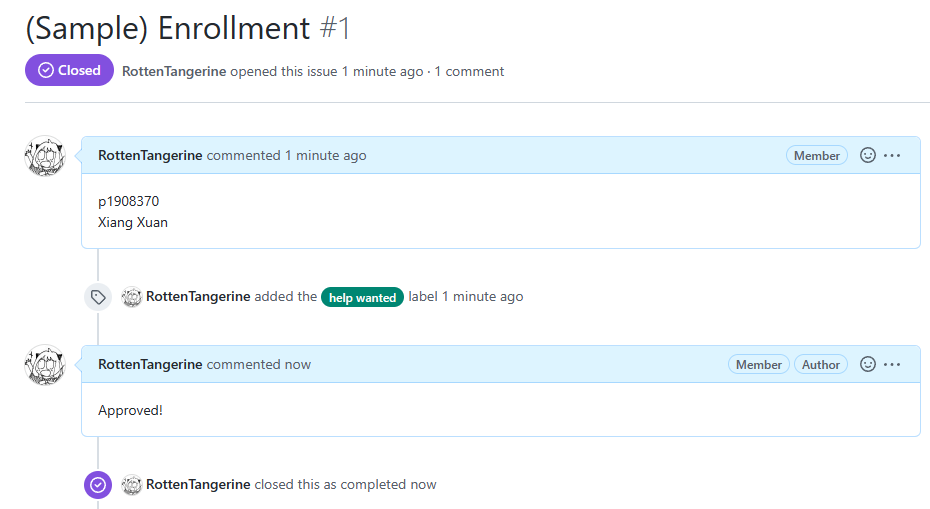

# Enrollment Guide
This repository is an enrollment entrance for this organization.

Please follow these steps to send your enrollment request to enroll in our organization:

1. Click on the `Issues` button and then click on the `New issue` green button to **create a new issue**.
2. Enter your **Student ID** and your **English Name (e.g. Xiang Xuan) Not your NICKNAME (e.g. Jack, Michael, etc.)** in the issue body. (**If you are interested in our maintenance team, Please also mention in it**).
3. Don't forget to submit ^^.

Our team member will handle your request ASAP. After you pass the verification, we will let you in.

When you become a member of the organization you will have access to the private repository (course slides).
